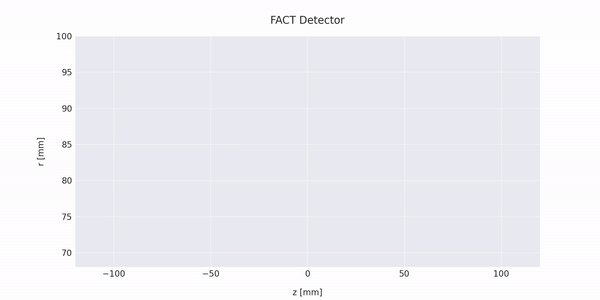

# Online tool for Live Plotting of FACT Data

  

The Fast Annihilation Cryogenic Tracker (FACT) detector aims to demonstrate the production of antihydrogen, as a step on the way towards performing a gravity measurment of antihydrogen by the AEgIS collaboration. This directory is the working directory for developing softwear for analysis on the ROOT-files that the detector is putting out. The package reads the ROOT files from a local drive linked under /Data/, and runs analysis either on single or multiple data files. The analysis is then displayed with several visualization modules, as described in further detail down below. 

_Intention:_ This package intends to provide easy access to the FACT data, as it is streamed directly from the detector into the Data directory. This will make it easier to check that everything runs as it should, and to perform easy analysis on top of the data.

_Future Development:_ The softwear is currently in it's initial phases of development, where the basic functionalities are implemented. Like for instance clustering algorithms and vertex reconstructions. Further development entails building a solid GUI system, exec systems and a wider range of visualization tools. One also has to develop a simple way to easily implement any physical changes on the detector. 

### Installation

The package will at a later time be wrapped as an executable, and run through a user interface. 
As of now the program runs in a virtual environment directly through src/main.py.

#### Setting up the Virtual Environment
To set up the virtual environment please run from main dir

    ../LivePlotting$: pipenv install
    ../LivePlotting$: pipenv shell 
    ../LivePlotting$: pip install -r requirements.txt
  

#### Usage
Running from main.py:
    
    ../LivePlotting$: pipenv shell
    ../LivePlotting/src$: python3 main.py

#### Running Unit Tests
Run Unit Testing by either running 

    ../LivePlotting/src/src_UnitTesting/$: test_<Class>.py
    ../LivePlotting/src/src_UnitTesting/$: test_SetUp.py

or by running the modules directly

    ../LivePlotting/src/src_<module>$: <module>.py
    ../LivePlotting/src/src_SetUp$: SetUp.py

### Support 
Primary developer: Oline Ranum - olinear@uio.no

# Build

## Main Folder Structure
    
    src:        
        The source code of the program. 
        
    settings: 
        settings.txt : This file contains all physical parameters of the detector. 
                       The parameters are described in a separate file under Documentation - settings.pdf
        
    Data_Example:
        Contains one example file that can be run from /Data/
        

## Flow

    Run through main.py.

*Main.py*: Performs three tasks. 1) Loads param = Sets detector parameters. 2) Makes a call to the RunAnalysis modules, and sets whether to perform a single file or a multi-file analysis. 3) Makes final call to plotting and visualization.

*RunAnalysis*: Has two modules called RunSingleFileAnalysis and RunMultiFileAnalysis. RunSingleFileAnalysis builds a standard setup through the SetUp class and then calls to AnalysisToolBox [ATB]. When the ATB module Initiate_Standard_Analysis() is called a _standard_ analysis is performed, and a pandas DataFrame containing the vertex positions and weights are provided. When RunMultiFileAnalysis is called, a call is made to RunSingleFileAnalysis for each file in the directory. The information is then collected in a single large Dataframe containing the combined list of the vertices from all the individual files. 

### Vertex Analysis 
The standard analysis packages entail a vertex reconstruction along the z-axis, returning the position of a vertex and the weight of the vertex. 
The weight of a vertex is defined as 1/(The number of potential particle origins), as the combinatorics might yield several solutions for potential vertices within a certain time/space region. 

## FlowChart

## Main Information Holders
The analysis is run with two primary information holders, as the system has two main sources of information. One is the raw data put out by FACT, the other being the external input of physical detector parameters. 

1. *param:* Param is an instance of the class LoadData holding all the external parameters set in the file settings/settings.txt. Furthermore, the instance holds the coordinate mapping providing z and r coordinates of each singular fiber in the property param.CoordinateMatrix. 
        
2. *MainData:* Main data holds the raw data file containing the fiber activation information of fiber number N, activation timestamp t, and the time over threshold tot. During the SetUp.CombineDatabases() procedure, this main dataframe is expanded to include the r, z positioning of each fiber N. I.e. a DataFrame on the column format ['N', 't', 'tot', 'z', 'r'].

## Raw Data Files
The FACT system produces raw datafiles on the format of

| **N**   | **t** | **tot** |
|-----|---|-----|
| 412 | 0 | 5   |
| 5   | 5 | 15  |
| 200 | 5 | 10  |
...
| 645 | 35| 10  |

N: The unique fiber number yielding the coordinates z, r
t: The time stamp when a fiber fiers 
tot: The time the fiber stays activated after a fiber has fiered, proportional to the incoming energy of the fiber

# Visualization Output

## Issue/Project Management
-> GitKraken Boards

# Roadmap
Ideas for future development

# Authors and acknowledgment

## Contributors 
| **Name**   | **Contact** |
|-----|---|
| Oline A. Ranum | olinear@uio.no | 
    
    
## How to start with getting to know the project 
..............

# Project status
Early stages of development 
Working on building cornerstones of the system 

# Future TODOs':
 -> Build the connection between the detector and the _/Data/_ folder. 
